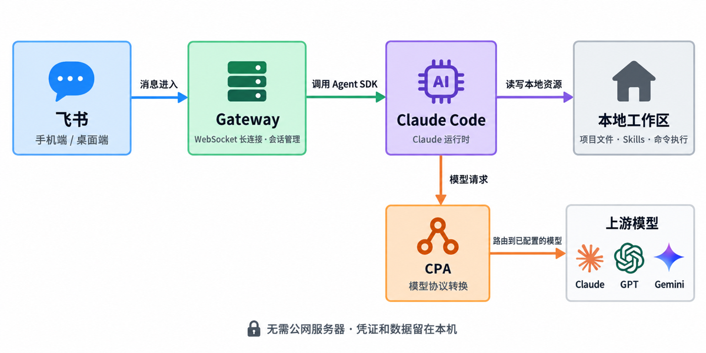

# Feishu Agent Gateway

在飞书手机端或桌面端发消息和图片，让 Agent 在你的电脑上处理文件、运行命令，并多轮对话。

→ Gateway 主动连接飞书，无需公网 IP 或入站端口。电脑必须保持运行，且能访问飞书和 CPA。

→ 当前入口是飞书 Bot；项目不包含独立 Web 聊天页面。

## 文档

| 你要做什么 | 从这里开始 |
|---|---|
| 第一次安装，发送第一条消息 | **[安装指南](docs/setup.md)** |
| 查配置字段、默认值或环境变量 | [配置参考](docs/configuration.md) |
| 理解架构和代码，修改或打包 | [技术设计](docs/architecture.md) |

## 功能概览

- 图文输入（最多 4 张 / 5 MiB）
- 多轮会话、历史切换、会话置顶
- 飞书命令切换模型，无需重启
- 单实例绑定一个工作区和一个操作用户
- 模型能力取决于 CPA 上游

当前尚未发布 npm 包；从源码构建或安装 `.tgz`，见安装指南。

MIT License © 2026 KetchupZ
