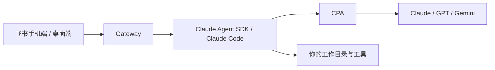

# Feishu Agent Gateway

在飞书手机端或桌面端，把文字和图片发给机器人，让 Agent 在你的电脑上处理文件、运行命令，并继续多轮对话。

飞书负责聊天入口，Claude Code 负责工具执行，CPA 负责连接你已配置的模型。

→ Gateway 主动连接飞书，无需公网 IP、域名或入站端口。电脑必须保持运行，且能访问飞书和 CPA。

→ 当前入口是飞书 Bot；项目不包含独立 Web 聊天页面。

| 你要做什么 | 从这里开始 |
|---|---|
| 第一次安装，配置 CPA 和飞书，发送第一条消息 | **[使用指南](docs/user-guide.md)** |
| 查某个配置字段、默认值或环境变量 | [配置参考](docs/configuration.md) |
| 理解架构、权限、会话实现，修改或打包项目 | **[技术设计](docs/architecture.md)** |

支持图文、多轮会话、模型切换、历史会话与中断任务。每实例绑定一个工作区和一个允许操作的飞书用户；模型能力取决于 CPA 上游。

当前尚未发布 npm 包；使用包含此 README 的源码构建，或安装由该源码打出的 `.tgz`。安装命令见使用指南。

MIT License © 2026 KetchupZ
