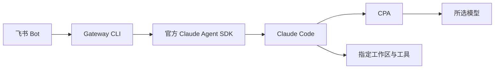

# Feishu Agent Gateway v2

在飞书里给自己的电脑发任务：多轮聊天、图片理解、文件处理和终端操作。

安装目录、工作目录、配置和运行数据互相独立。业务知识和 Skills 属于工作区，Gateway 只负责连接与会话控制。



## 当前范围

- 一个实例绑定一个工作区、指定飞书用户和当前会话。其他发送者默认拒绝；可进一步限制聊天 ID。多个聊天需要隔离时使用独立实例。
- 文字、纯图片和图文；每条最多 4 张、每张 5 MiB，支持 PNG/JPEG/GIF/WebP。
- `/new`、`/model`、`/sessions`、`/switch`、`/pin`、`/unpin`、`/top`、`/stop`、`/status`。
- 官方 Claude Agent SDK；`runtime`、`provider`、`model` 独立配置。
- Bash 沙箱启用，额外权限请求不会自动获准。
- Node.js 20+；macOS、Linux、WSL2。Linux/WSL2 需要 Claude 沙箱依赖。

v2 当前是候选版本，尚未发布到 npm。下面使用本地 tarball 安装；旧版多运行时和个人工作区脚手架保留在 Git 历史。

## 快速开始

在 v2 源码目录：

```bash
npm ci
npm test
mkdir -p releases
npm pack --pack-destination releases
FGW_APP_ROOT="$HOME/.local/share/feishu-agent-gateway/app"
npm install --prefix "$FGW_APP_ROOT" --omit=dev ./releases/feishu-agent-gateway-2.0.0-alpha.1.tgz
FGW_BIN="$FGW_APP_ROOT/node_modules/.bin/feishu-agent-gateway"
"$FGW_BIN" init --workspace /absolute/path/to/your/workspace
```

默认配置是 `~/.config/feishu-agent-gateway/config.yaml`。按[配置示例](examples/config.yaml)填写目录、模型、私有凭据文件；也可使用 `FEISHU_APP_ID`、`FEISHU_APP_SECRET`、`FEISHU_ALLOWED_OPEN_ID`、`CPA_API_KEY` 环境变量。

```bash
"$FGW_BIN" doctor --online
"$FGW_BIN" start
"$FGW_BIN" status
"$FGW_BIN" stop
```

`doctor` 默认检查配置，`--online` 额外检查 CPA 认证和模型。`start` 等待飞书连接就绪；`status` 返回运行实例的真实状态。本机不需要 GPU。

## 文档

| 文档 | 内容 |
|---|---|
| [部署指南](docs/deployment.md) | 配置、Mac/Linux 常驻、升级回滚、权限 |
| [飞书配置](docs/feishu.md) | Bot、消息事件、资源与白名单 |
| [v2 迁移](docs/migration-v2.md) | 会话保留与宿主薄入口 |
| [架构](docs/architecture.md) | 模块、执行与发布边界 |

## 发布前验证

```bash
npm test
npm pack --pack-destination releases
node scripts/check-package.mjs releases/feishu-agent-gateway-2.0.0-alpha.1.tgz
```

发布物只含编译代码、示例和文档；真实凭据、日志、工作区、会话与附件不属于包。公开推送和发包单独执行。

MIT License © 2026 KetchupZ
