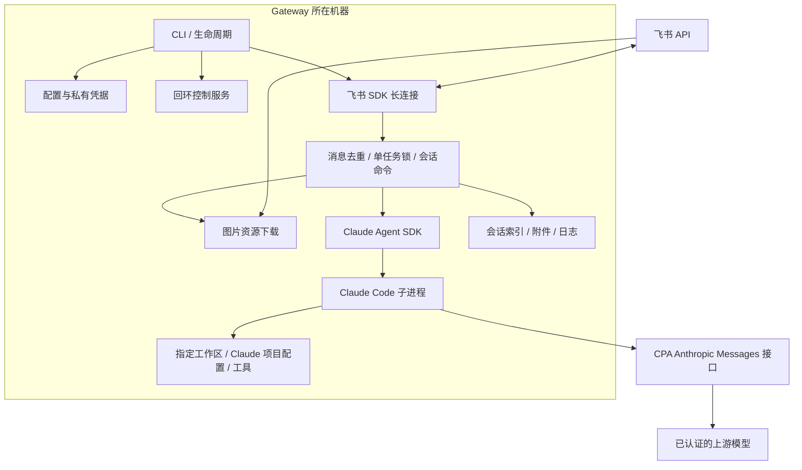
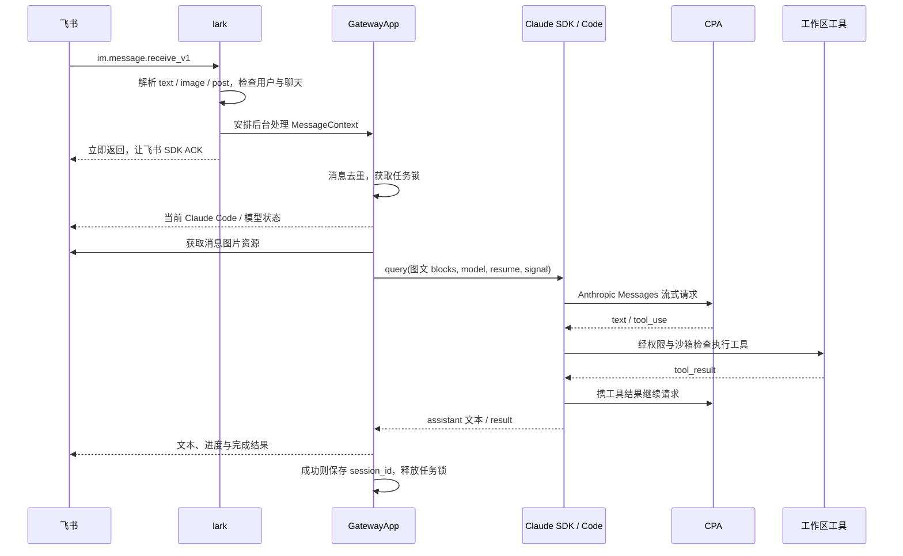
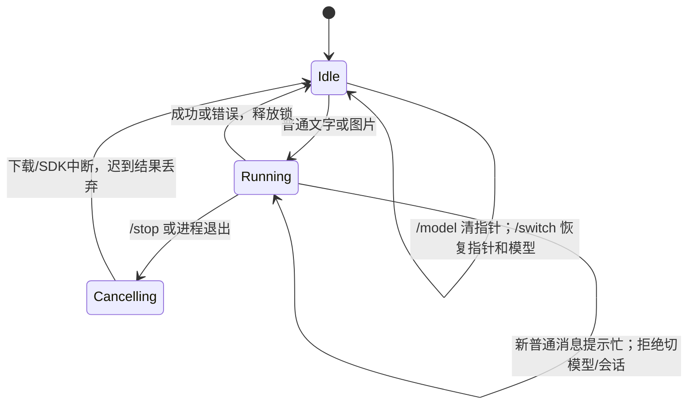

# 技术设计

面向维护者：理解消息如何变成工具任务、状态由谁保存，以及如何开发和验证。安装操作由[使用指南](user-guide.md)负责，字段契约由[配置参考](configuration.md)负责。

## 系统边界

Gateway 连接飞书并管理会话；Claude Code 执行工具，CPA 提供模型协议转换。



→ Gateway 不持有上游账号 OAuth；只持有 CPA 客户端 Key。模型 ID 与执行底座分离，选择 GPT/Gemini 仍使用 Claude Code 的工具系统。

→ 每实例一个工作区、一个允许操作的用户、一条当前会话。当前实现不提供多用户调度、独立 Web UI、远程权限审批或容器隔离。

## 代码职责与依赖

| 位置 | 唯一职责 |
|---|---|
| `src/cli.ts` | 参数、配置生成、doctor、后台启动与生命周期命令 |
| `src/config.ts` | 配置解析、路径、凭据、允许的模型 |
| `src/run.ts` | 实例启动/退出、飞书连接健康、外部进程托管 |
| `src/control.ts` | 本地认证控制端点、实例身份与重复启动保护 |
| `src/lark/` | 飞书事件解析、发送者过滤、图片下载、回复格式 |
| `src/app/gateway.ts` | 会话命令、单任务执行、取消与结果落盘 |
| `src/runtime/claude.ts` | SDK 参数、子进程环境、图文输入、流式结果 |
| `src/state/` | Claude 会话索引、当前指针、置顶 |
| `src/logger.ts` | JSON 日志和密钥脱敏 |

| npm 运行依赖 | 用途 |
|---|---|
| `@anthropic-ai/claude-agent-sdk` | `query()`、图文输入、resume、Claude 运行时 |
| `@larksuiteoapi/node-sdk` | 飞书认证、WebSocket、消息与 HTTP transport |
| `yaml` | YAML / JSON 配置解析 |

TypeScript、tsx、Node 类型声明仅用于开发；准确版本由 `package.json` 和发布时携带的 `npm-shrinkwrap.json` 锁定。SDK 的平台运行时是 optional dependency，安装时不能使用 `--omit=optional`。

## 一条图文消息怎样执行

事件通过身份校验后安排后台任务并立即 ACK；任务锁通过后才下载，SDK 成功后才保存会话。



| 外部能力 | 本项目如何使用 | 一手接口说明 |
|---|---|---|
| 飞书消息事件 | 订阅 `im.message.receive_v1`，解析文本、纯图片、本地化 post | [接收消息](https://open.feishu.cn/document/server-docs/im-v1/message/events/receive) |
| 飞书发送与回复 | SDK `im.message.create/reply`，文字或卡片 | [发送消息](https://open.feishu.cn/document/uAjLw4CM/ukTMukTMukTM/reference/im-v1/message/create) |
| 飞书消息资源 | `GET /open-apis/im/v1/messages/{message_id}/resources/{file_key}?type=image` | [消息资源接口](https://open.feishu.cn/document/uAjLw4CM/ukTMukTMukTM/reference/im-v1/message-resource/get) |
| Claude Agent SDK | `query()` 接收流式 user message，返回 assistant/result，支持 resume/abort | [SDK 概览](https://code.claude.com/docs/en/agent-sdk/overview) |
| CPA 模型发现 | `GET /v1/models`，doctor 检查默认模型 ID | [CPA](https://github.com/router-for-me/CLIProxyAPI) |
| CPA 推理 | 由 Claude Code 调用 Anthropic Messages 接口，需正确处理流式文本、图片与工具回合 | [Claude 网关约定](https://code.claude.com/docs/en/llm-gateway)、[CPA 客户端接入](https://help.router-for.me/agent-client/claude-code) |

飞书要求事件处理在 3 秒内完成确认。handler 不等待整个 Agent 任务；后台链自行捕获错误、记录日志并回复。[飞书长连接约束](https://open.feishu.cn/document/server-docs/event-subscription-guide/event-subscription-configure-/request-url-configuration-case)。ACK 后若进程崩溃，未完成任务不会自动恢复；当前没有持久任务队列。

图片下载直接复用飞书 SDK 的鉴权与 HTTP transport，因为高层 resource helper 不透传取消信号。文件名由 Gateway 生成，以文件头检查格式；每条最多 4 张、每张 5 MiB、每张下载 30 秒超时。

## 会话与取消

运行时只接受一项任务；切换模型会清空当前指针，切换历史会话会恢复它的模型。



```text
接收普通消息:
  固定本轮 model 和 session_id          # 避免执行中状态变化串话
  下载全部图片                         # 任一失败就清理本次附件
  执行 SDK query
  若已取消: 丢弃迟到结果                # 不让中断任务恢复当前会话
  若 result 非明确成功: 回复错误
  若成功且有 session_id: 保存索引与指针
  finally: 释放锁；失败/取消清理本次附件
```

| 状态 | 存在哪里 | 行为 |
|---|---|---|
| 当前会话、模型、标题、置顶 | `data_dir/.gateway_claude_sessions.json` | 临时文件写入后 rename；启动获得实例控制权后恢复模型 |
| 原生对话与工具历史 | Claude Code 用户数据目录，通常在 `~/.claude/projects/` | 由 SDK/Claude Code 管理，resume 时沿用工作区 |
| 成功图片 | `data_dir/attachments/feishu/` | 当前不自动过期；失败和取消时清理本次下载 |
| 去重消息 ID | 内存，最多最近 500 条 | 进程重启后不保留，不保证跨重启 exactly-once |
| 运行状态 | `gateway.pid` 与 `gateway-control.json` | CLI 通过认证端点操作，不盲信 PID 发信号 |

`/new` 与 `/stop` 保留历史并清空当前指针。配置移除当前会话模型时，启动会清指针并记警告，下次开启新会话。

## 权限与进程控制

飞书身份过滤决定谁能发任务，Claude 权限决定工具能做什么，两层都必须通过。

| 边界 | 实现 |
|---|---|
| 飞书入口 | 强制单用户 Open ID 白名单；可叠加聊天 ID 列表 |
| Claude 配置 | `settingSources: ["project"]`；使用 Claude Code preset，追加飞书回复风格 |
| 文件与 Bash | `acceptEdits`；sandbox enabled、failIfUnavailable、禁止 unsandboxed commands |
| 额外权限请求 | `canUseTool` 返回 deny；不把聊天文字当作工具授权回调 |
| 子进程环境 | 系统/代理/证书及宿主安全环境白名单；额外工具变量通过 `pass_env` 指定 |
| CPA 路由 | 当前实例注入 Anthropic URL/token；不修改用户全局 Claude/Codex 配置 |
| 控制服务 | 仅 `127.0.0.1`；随机 token 存入 0600 文件，核对实例 PID 与数据目录 |
| 数据记录 | 脱敏已知密钥与认证字段；日志仍可能包含问题摘要、路径、工具状态 |

启动顺序：配置 → 本地控制权 → 会话模型恢复 → 飞书连接 → 可选外部进程。`start` 最多等待约 30 秒连接就绪；运行后飞书持续未就绪超过 120 秒会退出，由服务管理器决定是否重启。

退出时停止接收消息、中断 SDK/下载、停止自己托管的外部进程并清理控制记录；5 秒内未完成会退出。Bash 沙箱不是整个进程的虚拟机隔离；用户文件、项目 hooks 与额外 listener 需要按各自权限管理。[Claude 沙箱说明](https://code.claude.com/docs/en/sandboxing)。

## 开发与打包

从源码构建后，打包检查在临时目录独立安装，确认不需要宿主仓库的脚手架。

```bash
npm ci
npm test
npm run build
mkdir -p releases
npm pack --pack-destination releases
# 用上一步打印的真实文件名替换下面的路径。
node scripts/check-package.mjs releases/实际生成的包名.tgz
```

| 验证 | 覆盖范围 |
|---|---|
| `npm test` | 配置、身份、图片边界、会话恢复、取消、认证控制、日志脱敏 |
| `check-package.mjs` | 产物白名单、依赖锁、可执行入口、空工作区、空格路径、只读安装目录 |
| `npm run smoke -- /private/config.yaml` | 真实 CPA 图像识别、同 session 续聊、Bash 写文件；需 Git 与上游额度，不访问飞书 |
| 手工飞书验收 | [使用指南的检查顺序](user-guide.md#5-启动并验收)；验证真实权限、收发与上游组合 |

`doctor --online` 不是端到端推理测试。不同 CPA 版本/渠道/模型的图文和工具兼容性，以该组合的 smoke 与实际任务为准；当前验证过的组合不能代表所有模型都可用。

发布内容由 `package.json.files` 控制：编译代码、依赖锁、配置示例和文档。源码测试、真实配置、凭据、工作区和运行数据不进入安装包；CI 执行测试、打包与独立安装检查。

## 修改哪里

| 需求 | 入口与约束 |
|---|---|
| 增加 CPA 已有模型 | 改实例的 `model/models`，不改源码；先验证该模型的图文和工具能力 |
| 新飞书消息类型 | 扩展 `lark/event-parser.ts` 和附件处理，沿用身份、锁与取消顺序 |
| 新 Agent 底座 | 新增实现 `AgentChatExecutor` 的 adapter，并明确图文、resume、取消与权限能力；配置值目前不能直接启用它 |
| 新聊天通道 | 新入口转换为消息上下文和 reply adapter；独立决定身份与会话隔离 |
| 增加业务能力 | 在目标工作区维护 Claude 项目配置、Skills 与工具依赖；通用网关不内置业务脚本 |
