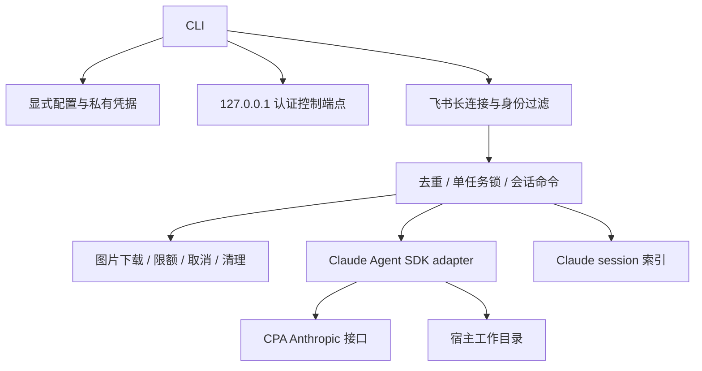

# v2 架构

一个包承担通用网关逻辑，宿主只传配置、工作目录和版本。

| Owner | 职责 |
|---|---|
| `config.ts` | 配置、路径、凭据来源；不推断宿主结构 |
| `lark/` | 消息、身份、附件、回复 |
| `app/gateway.ts` | 会话与执行顺序 |
| `runtime/claude.ts` | 官方 SDK、CPA 环境、结果与取消 |
| `state/` | 本实例会话、当前指针、置顶 |
| `control.ts` | 回环地址上的认证状态/停止协议 |
| `run.ts` | 前台进程与可选 listener 生命周期 |

→ 鉴权、去重与任务锁成功后才下载；运行中先停止再切模型或会话。

→ 取消贯穿 HTTP 和 SDK；失败清理附件，成功附件保留供续聊。

→ Claude 与其他运行时 ID 不混用，业务逻辑由工作区 Skills 提供。重启恢复当前会话对应模型；模型被移出配置时保留历史并开启新会话。

安装目录只放程序。控制端点使用私有随机令牌，停止不直接杀未知 PID。实例固定端口与进程存活检查共同拒绝重复启动。发布物使用 `files` 白名单并经 tarball 独立安装验证。
