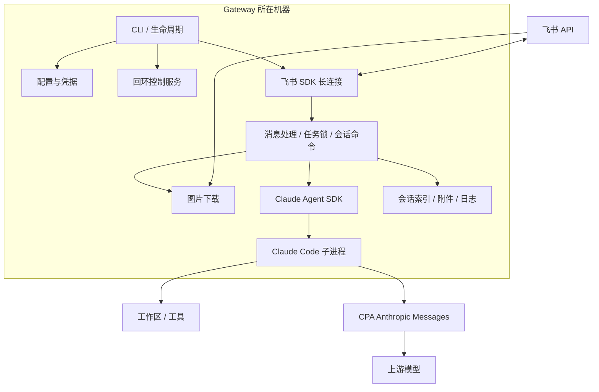
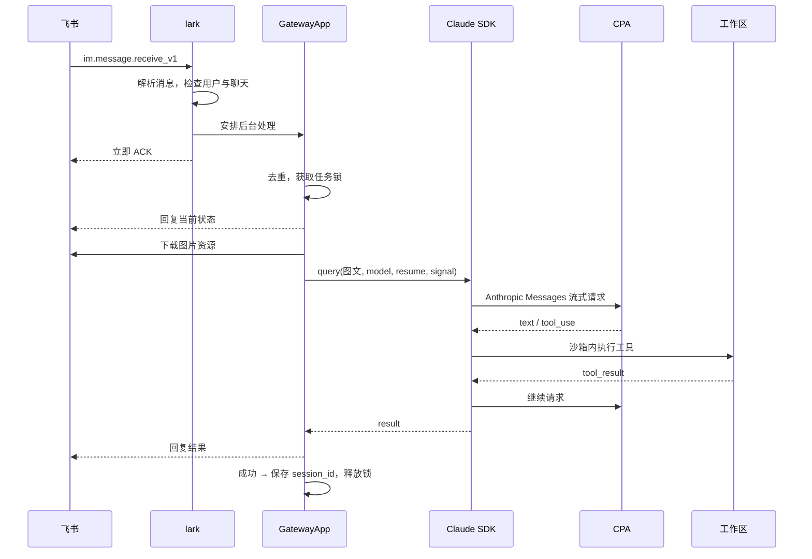
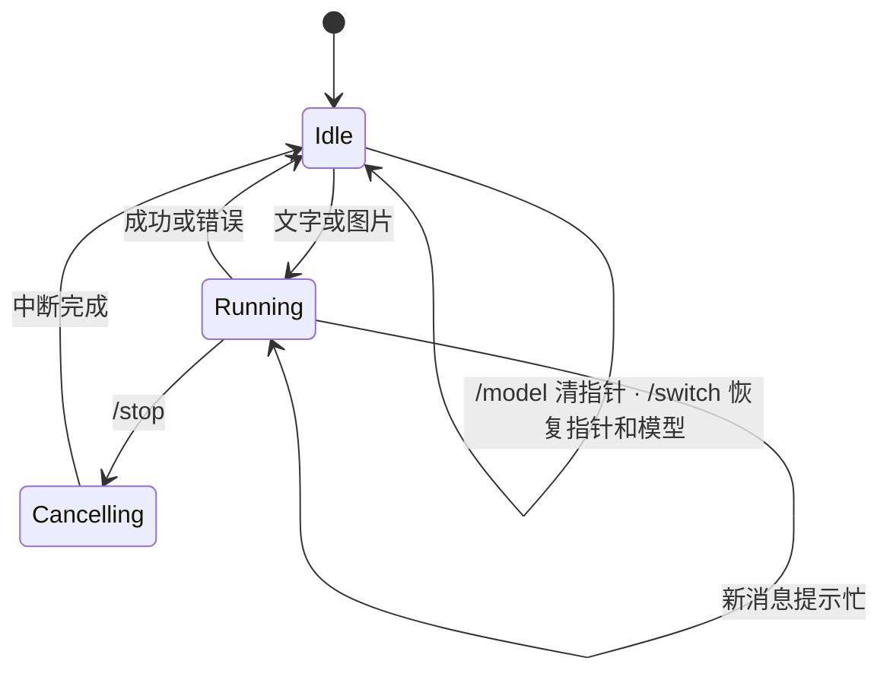

# 技术设计

面向维护者：理解系统整体、定位代码模块、知道怎么开发和验证。安装见[安装指南](setup.md)，字段见[配置参考](configuration.md)。

## 系统边界

Gateway 连接飞书并管理会话；Claude Code 执行工具；CPA 提供模型协议转换。



→ 每实例绑定一个工作区、一个操作用户、一条当前会话。没有多用户调度、Web UI 或远程审批。

→ Gateway 只持有 CPA 客户端 Key，不持有上游 OAuth。选择 GPT/Gemini 仍使用 Claude Code 的工具系统。

## 模块职责

分三层理解：**入口与生命周期**、**消息处理**、**外部集成**。

### 入口与生命周期

| 文件 | 职责 |
|---|---|
| `src/cli.ts` | CLI 入口：init / doctor / start / stop / restart / status / logs |
| `src/config.ts` | 配置解析、路径规范、凭据读取、模型白名单校验 |
| `src/run.ts` | 前台运行：启动顺序（配置 → 控制权 → 会话恢复 → 飞书连接 → 外部进程），退出清理，健康检测 |
| `src/control.ts` | 本地认证控制端点：实例身份、重复启动保护、status/stop API |

### 消息处理

| 文件 | 职责 |
|---|---|
| `src/app/gateway.ts` | 会话命令分发、单任务执行、取消与结果落盘 |
| `src/app/task-lock.ts` | 同一时刻只运行一个任务 |
| `src/app/stop-controller.ts` | 取消信号传播，丢弃迟到结果 |
| `src/state/sessions.ts` | Claude 会话索引：当前指针、历史列表、置顶 |

### 外部集成

| 文件 | 职责 |
|---|---|
| `src/lark/client.ts` | 飞书 SDK 长连接、事件注册、发送者白名单过滤 |
| `src/lark/event-parser.ts` | 解析 text / image / post 消息类型 |
| `src/lark/image-download.ts` | 图片资源下载：格式校验、大小限制（4 张 / 5 MiB）、超时 |
| `src/lark/reply-adapter.ts` | 文字与卡片回复格式化 |
| `src/runtime/claude.ts` | Claude SDK 参数构造、子进程环境隔离、图文输入、流式结果 |
| `src/runtime/types.ts` | `AgentChatExecutor` 接口 |
| `src/logger.ts` | JSON 日志、密钥脱敏 |

### npm 运行依赖

| 包 | 用途 |
|---|---|
| `@anthropic-ai/claude-agent-sdk` | `query()` / resume / abort / Claude 平台运行时 |
| `@larksuiteoapi/node-sdk` | 飞书认证、WebSocket、消息 HTTP transport |
| `yaml` | 配置解析 |

SDK 的平台运行时是 optional dependency，安装时不能 `--omit=optional`。

## 一条图文消息怎样执行

事件通过身份校验后安排后台任务并立即 ACK（飞书要求 3 秒内确认）。



| 外部能力 | 一手文档 |
|---|---|
| 飞书消息事件 | [接收消息](https://open.feishu.cn/document/server-docs/im-v1/message/events/receive) |
| 飞书发送与回复 | [发送消息](https://open.feishu.cn/document/uAjLw4CM/ukTMukTMukTM/reference/im-v1/message/create) |
| 飞书消息资源 | [消息资源接口](https://open.feishu.cn/document/uAjLw4CM/ukTMukTMukTM/reference/im-v1/message-resource/get) |
| Claude Agent SDK | [SDK 概览](https://code.claude.com/docs/en/agent-sdk/overview) |
| CPA 模型发现与推理 | [CPA](https://github.com/router-for-me/CLIProxyAPI)、[Claude 网关约定](https://code.claude.com/docs/en/llm-gateway) |

## 会话与取消

运行时只接受一项任务。



```text
接收普通消息:
  固定本轮 model 和 session_id    # 避免执行中串话
  下载全部图片                    # 任一失败就清理
  执行 SDK query
  若已取消 → 丢弃迟到结果
  若成功且有 session_id → 保存索引
  finally: 释放锁，失败/取消清理附件
```

### 状态存储

| 数据 | 位置 | 说明 |
|---|---|---|
| 会话索引（当前、历史、置顶） | `data_dir/.gateway_claude_sessions.json` | 临时文件 rename；启动后恢复模型 |
| 原生对话与工具历史 | `~/.claude/projects/`（Claude Code 管理） | resume 时沿用工作区 |
| 成功图片 | `data_dir/attachments/feishu/` | 不自动过期 |
| 去重消息 ID | 内存，最近 500 条 | 重启后不保留 |
| 运行状态 | `gateway.pid` + `gateway-control.json` | CLI 通过认证端点操作 |

## 权限模型

两层都必须通过：飞书身份过滤 + Claude 工具权限。

| 边界 | 实现 |
|---|---|
| 飞书入口 | 强制单用户 Open ID 白名单；可叠加聊天 ID 列表 |
| Claude 配置 | `settingSources: ["project"]`；Claude Code preset |
| 文件与 Bash | `acceptEdits`；sandbox enabled + failIfUnavailable；禁止 unsandboxed |
| 额外权限 | `canUseTool` 返回 deny；聊天文字不作为工具授权 |
| 子进程环境 | 白名单透传系统/代理/证书变量；额外工具变量通过 `pass_env` |
| CPA 路由 | 注入 `ANTHROPIC_BASE_URL`/`ANTHROPIC_AUTH_TOKEN`；不改全局配置 |
| 控制服务 | 仅 `127.0.0.1`；随机 token + PID 核对 |

→ Bash 沙箱不是整个进程的虚拟机隔离。工作区文件、项目 hooks 和外部 listener 各自管理权限。

## 开发与打包

```bash
npm ci
npm test                 # 配置、身份、图片边界、会话、取消、认证、脱敏
npm run build
mkdir -p releases
npm pack --pack-destination releases
node scripts/check-package.mjs releases/<实际包名>.tgz
```

| 验证手段 | 覆盖范围 |
|---|---|
| `npm test` | 单元：配置解析、身份过滤、图片限制、会话恢复、取消、控制认证、日志脱敏 |
| `check-package.mjs` | 产物白名单、依赖锁、可执行入口、空工作区、空格路径、只读安装目录 |
| `npm run smoke -- config.yaml` | 真实 CPA：图像识别、续聊、Bash 写文件（需上游额度，不访问飞书） |
| 手工飞书验收 | [验收步骤](setup.md#验收确认能用) |

→ `doctor --online` 不是端到端推理测试，只检查模型列表。不同 CPA/模型组合的兼容性以 smoke 和实际任务为准。

→ 发布内容由 `package.json.files` 控制。源码测试、凭据、工作区数据不进入安装包。

## 修改指南

| 需求 | 入口 |
|---|---|
| 增加模型 | 改实例 `model`/`models` 配置，不改源码 |
| 新飞书消息类型 | 扩展 `lark/event-parser.ts` 和附件处理 |
| 新 Agent 底座 | 实现 `AgentChatExecutor` 接口 |
| 新聊天通道 | 新入口转换为消息上下文 + reply adapter |
| 业务能力 | 在工作区维护 Claude Skills 和工具依赖 |
